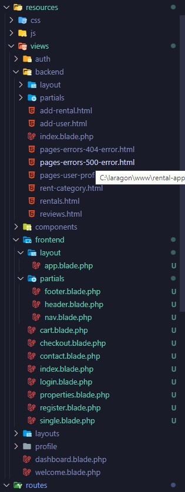

<h1 align='center'>Rental App<h1>
<h4>For frontend there two section in master template. which is located in resouce/views/frontend/layout</h4>
<ul>
<li>@yeild('page-title')</li>
<li>@yeild('page-content')</li>
</ul>
<h4>For backend there two section in master template. which is located in resouce/views/backend/layout</h4>
<ul>
<li>@yeild('page-title')</li>
<li>@yeild('page-content')</li>
</ul>
Backend master layout hold all css and footer section only. rest content goes to @section('page-content') section

